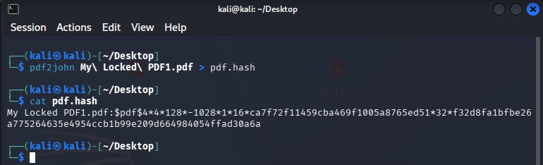
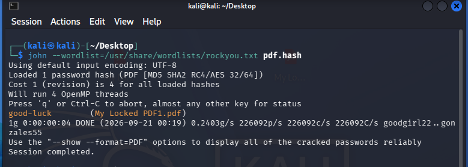
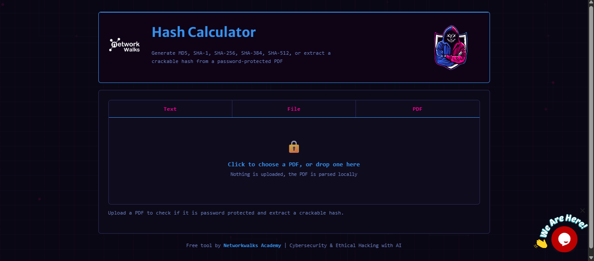
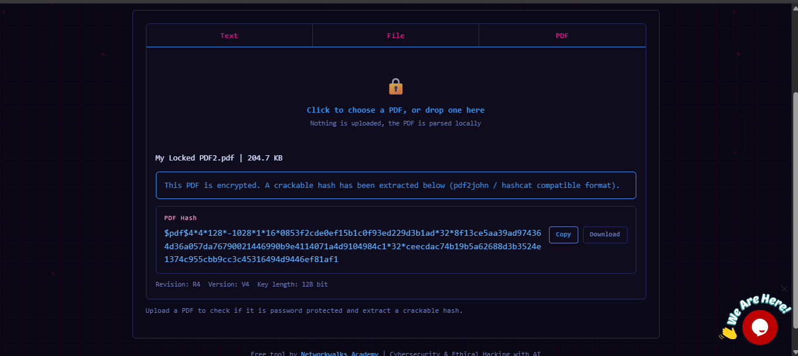
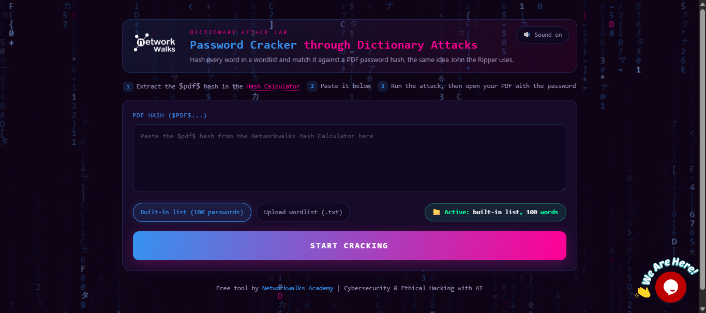
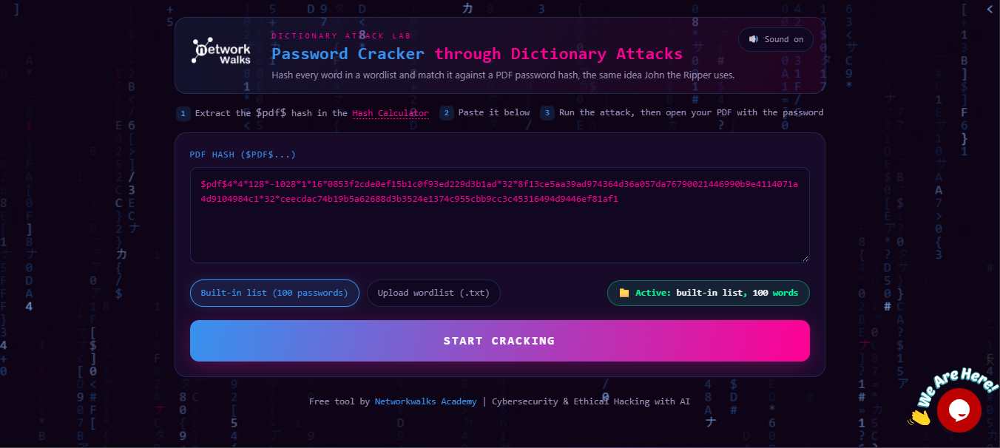
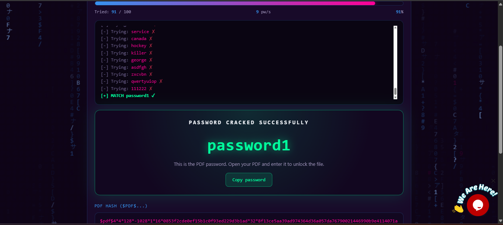

# Week 3 – Password Cracking with JTR and Networkwalks Tools

**Batch:** B083  
**Modules:** W3-PM1 and W3-PM2  
**Platform:** Kali Linux

---

## 📚 Week 3 Projects

| Project | Type | Status |
|---|---|---|
| **W3-PM1** | Password Cracking with JTR | ✅ Completed |
| **W3-PM2** | Password Cracking with Networkwalks Tools | ✅ Completed |
| **W3-OPTIONAL1** | AI – JTR Password Cracking Lab with Claude & Hexstrike MCP | ⏳ In Progress |
| **W3-OPTIONAL2** | Mediroza Hospital Patient Portal Hacking | ⏳ In Progress |

---

## W3-PM1 – Password Cracking with JTR

### Objective

The objective of W3-PM1 was to recover the password of the supplied protected PDF, **My Locked PDF1.pdf**, using **John the Ripper (JTR)**.

### Tools Used

- Kali Linux
- John the Ripper (JTR)
- `pdf2john`
- `rockyou.txt`
- Protected PDF

### Step 1 – Extract the PDF Hash

I used `pdf2john` to extract a crackable hash from the password-protected PDF.

```bash
pdf2john "My Locked PDF1.pdf" > pdf.hash
```

Then I checked the generated hash:

```bash
cat pdf.hash
```

The extracted value starts with `$pdf$`, confirming that the PDF hash was successfully obtained.



---

### Step 2 – Run John the Ripper

I used the RockYou wordlist to perform a dictionary attack against the extracted PDF hash:

```bash
john --wordlist=/usr/share/wordlists/rockyou.txt pdf.hash
```

John the Ripper successfully found the password:

```text
good-luck
```



### Result

**PDF Password:**

```text
good-luck
```

The cracking session completed successfully.


---

## W3-PM2 – Password Cracking with Networkwalks Tools

### Objective

The objective of W3-PM2 was to recover the password of the supplied protected PDF using the **Networkwalks Hash Calculator** and **Networkwalks Password Cracker**.

### Tools Used

- Web browser
- Networkwalks Hash Calculator
- Networkwalks Password Cracker
- Protected PDF

### Step 1 – Upload the PDF to Hash Calculator

I opened the Networkwalks Hash Calculator and uploaded the protected PDF.

The tool identified the PDF as encrypted and generated a crackable hash beginning with:

```text
$pdf$...
```



---

### Step 2 – Copy the PDF Hash

I copied the complete `$pdf$...` hash generated by the Hash Calculator.



---

### Step 3 – Open Networkwalks Password Cracker

I opened the **Networkwalks Password Cracker** page in my web browser.



---

### Step 4 – Paste the Hash and Start the Attack

I pasted the extracted PDF hash into the **Networkwalks Password Cracker** and started the attack by selecting **START CRACKING**.

The tool then tested the available dictionary entries against the PDF hash.



---

### Step 5 – Password Recovered

The tool successfully matched the password and displayed:

```text
MATCH password1
```

The recovered password was:

```text
password1
```



---

### Step 6 – Verify the Password

I entered the recovered password into the protected PDF and successfully opened the file.


---

## Flags Captured

### W3-PM1

```text
nw{cybersecurity_flag_captured_2608}
```

### W3-PM2

```text
nw{networkwalks_persistence_jtr_270521}
```


---

## Final Results

| Module | Tool | Password | Result |
|---|---|---|---|
| W3-PM1 | John the Ripper | `good-luck` | Successfully cracked |
| W3-PM2 | Networkwalks Password Cracker | `password1` | Successfully cracked |

---

## What I Learned

- How to extract a crackable PDF hash using `pdf2john`.
- How John the Ripper performs a dictionary attack.
- How to use the `rockyou.txt` wordlist with JTR.
- How to extract a PDF hash using the Networkwalks Hash Calculator.
- How to perform a dictionary attack using the Networkwalks Password Cracker.
- Why weak and common passwords can be recovered quickly.
- The importance of using strong passwords to protect files and information.

---

## Conclusion

Both Week 3 project modules were completed successfully.

In **W3-PM1**, I used John the Ripper on Kali Linux to extract and crack the password of the protected PDF.

In **W3-PM2**, I used the Networkwalks Hash Calculator and Password Cracker to extract the PDF hash and recover its password.

The exercises demonstrated the workflow of extracting a protected PDF hash, performing a dictionary attack, recovering the password, and verifying the password by opening the protected PDF.

---

## References

- Networkwalks – W3-PM1: *Password Cracking with JTR*
- Networkwalks – W3-PM2: *Password Cracking with Networkwalks Tools*
- John the Ripper: https://www.openwall.com/john/
- Networkwalks Hash Calculator: https://networkwalks.com/hash-calculator/
- Networkwalks Password Cracker: https://networkwalks.com/password-cracker/

> **Note:** These password-cracking activities were performed against the supplied cybersecurity training/lab PDFs.
